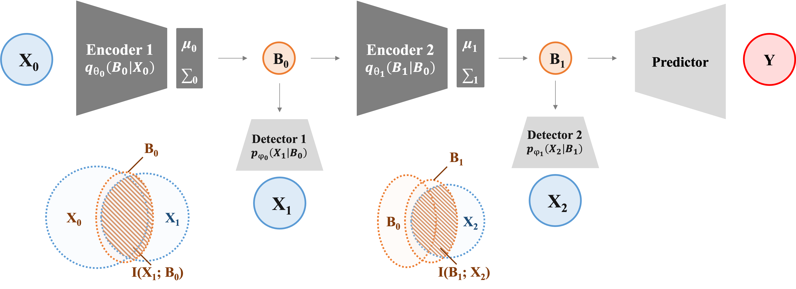

# Information-Theoretic Hierarchical Perception (ITHP)

[](https://github.com/joshuaxiao98/ITHP/stargazers)
[](https://github.com/joshuaxiao98/ITHP/network/members)
[](https://colab.research.google.com/gist/joshuaxiao98/58265fa4270f19e5eea307b5cf56448f/ithp_test.ipynb)

This repository hosts the official code for the paper "Information-Theoretic Hierarchical Perception for Multimodal Learning."

## Overview

Drawing on neurological models, the ITHP model employs the information bottleneck method to form compact and informative latent states, forging connections across modalities. Its hierarchical architecture incrementally distills information, offering a novel multimodal learning approach.



## Quick Start

1. Clone the repository and install dependencies:
   ```bash
   git clone https://github.com/joshuaxiao98/ITHP.git
   pip install -r requirements.txt
   ```

2. Download the datasets to `./datasets` by running `download_datasets.sh`. For details, see [here](https://github.com/WasifurRahman/BERT_multimodal_transformer).

3. Train the model on `MOSI` or `MOSEI` datasets using the `--dataset` flag:
   ```bash
   python train.py --dataset mosi   # For MOSI
   python train.py --dataset mosei  # For MOSEI
   ```

## Training Options

- Customize `train.py` for variable, loss function, or output modifications.
- Reduce `max_seq_length` from the default `50` for memory efficiency.
- Adjust `train_batch_size` to fit memory constraints.

## Citation

Please cite the following paper if this model assists your research:

```bibtex
@article{
  title={...},
  author={...},
  journal={...},
  year={...}
}
```

Experiment with the model in Google Colab:
[](https://colab.research.google.com/gist/joshuaxiao98/58265fa4270f19e5eea307b5cf56448f/ithp_test.ipynb)
